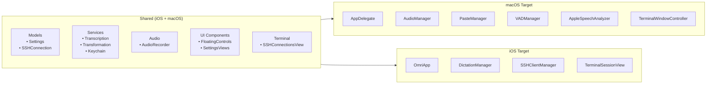
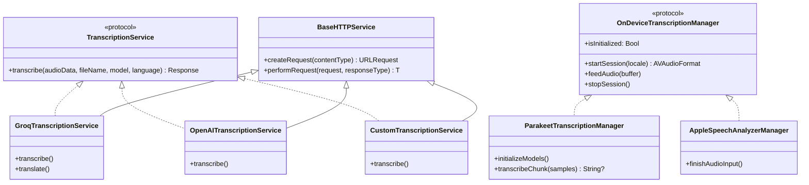
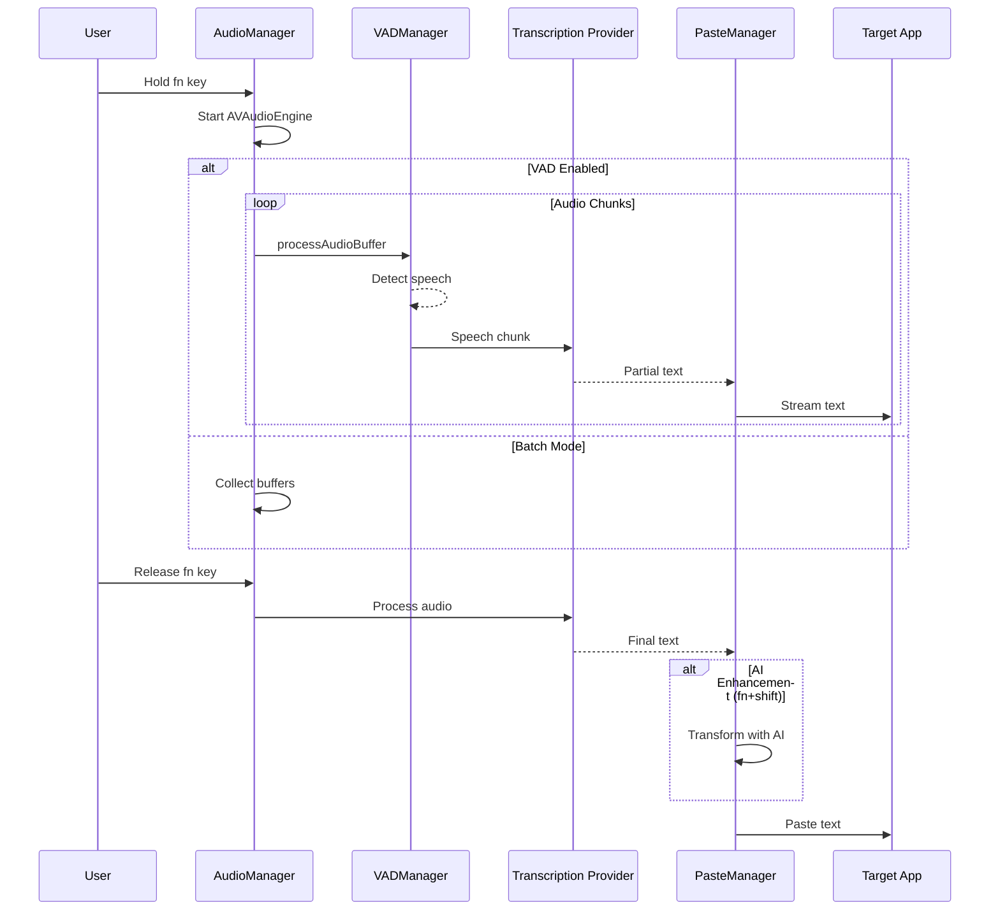
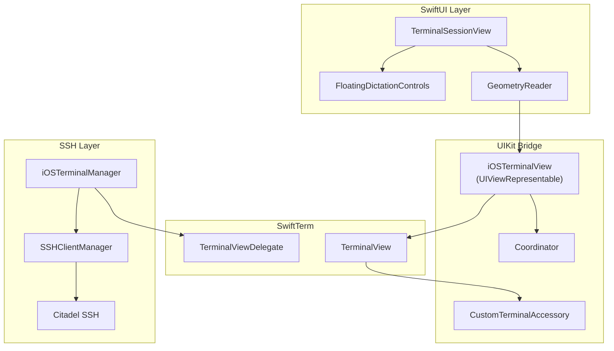
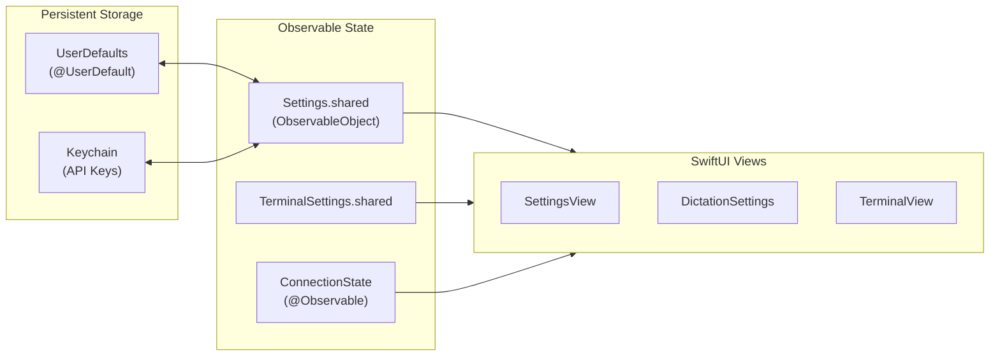

# Omri Architecture

Detailed technical architecture diagrams for developers.

## Cross-Platform Code Sharing

## Service Layer

## Audio Processing Pipeline

## Terminal Architecture (iOS)

## Settings & State Management

