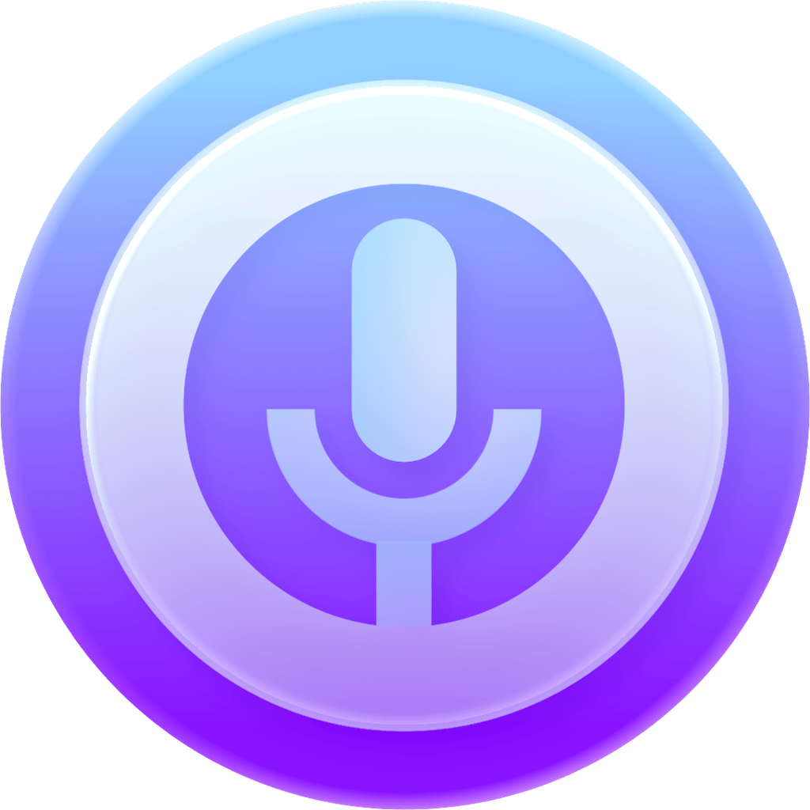
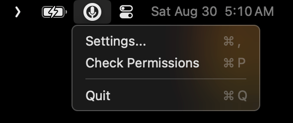
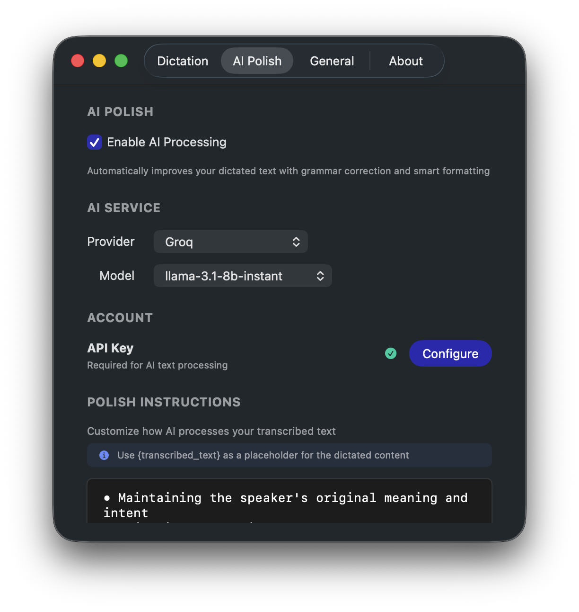
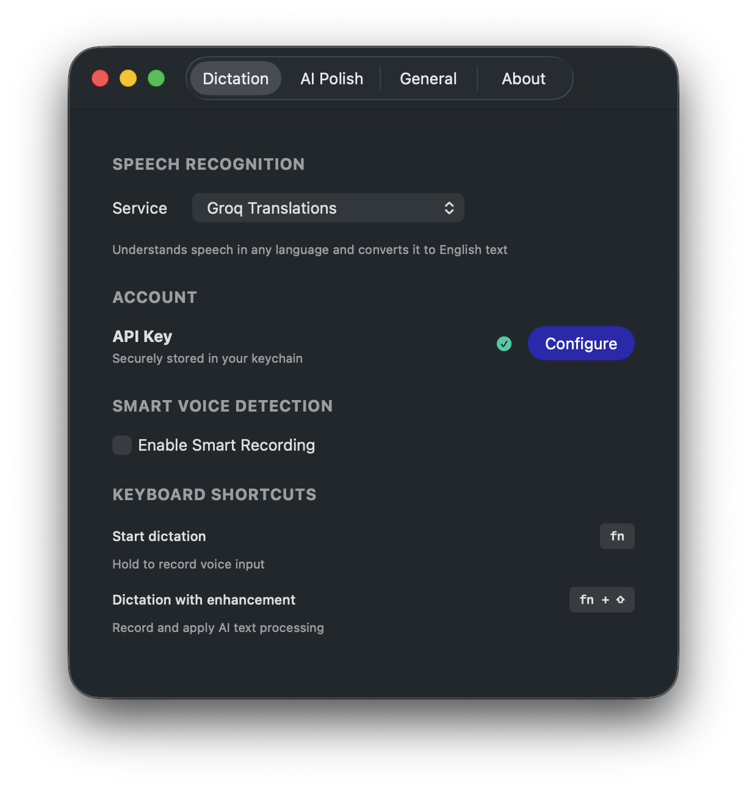
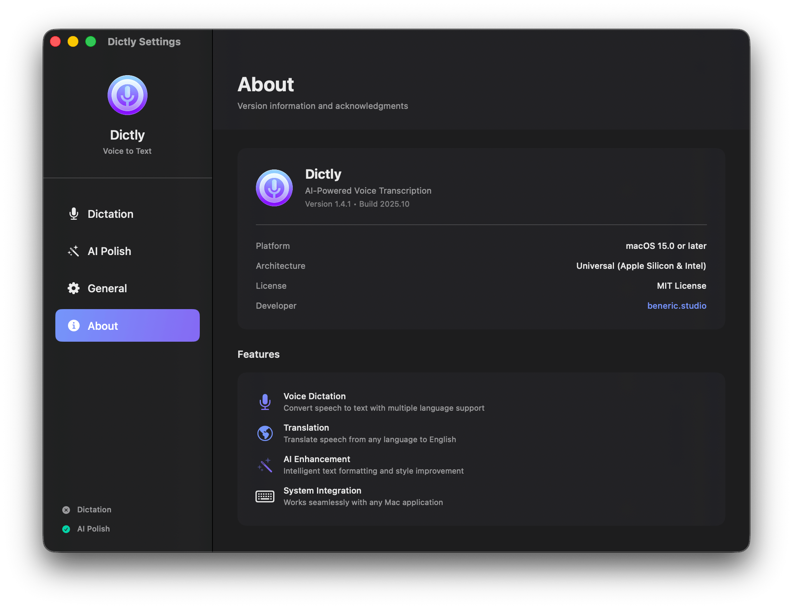

<div align="center">
  
  
  # Omri
  
  **macOS voice transcription with your own API keys**
</div>

An alternative to expensive transcription subscriptions. Choose from 100% private on-device transcription (macOS 14+ with Parakeet, macOS 26+ with Apple), your own Groq/OpenAI API keys, or local AI models for fast, accurate voice-to-text with optional AI enhancement.

## Screenshots

<table>
<tr>
<td width="50%">

### Menu Bar


</td>
<td width="50%">

### Dictation Settings


</td>
</tr>
<tr>
<td>

### AI Polish


</td>
<td>

### General Settings


</td>
</tr>
</table>

### About


## Features

- **Hold fn key** → speak → get text anywhere
- **Hold fn + shift** → AI-enhanced text
- **100% private on-device transcription** - Parakeet (macOS 14+, 25 languages) or Apple (macOS 26+)
- **ANE-accelerated** - runs on Apple Neural Engine for optimal performance
- Works in any macOS app
- Cloud APIs (Groq/OpenAI) or local AI models (Ollama, LM Studio)
- Menu bar app, stays out of your way

## Quick Start

1. **Choose Your Transcription Provider**
   - **Parakeet (On-Device)** (macOS 14+): 100% private, ANE-accelerated, 25 European languages, no API key
   - **Apple (On-Device)** (macOS 26+): 100% private, native macOS, no API key, works offline
   - **Cloud**: [Groq](https://console.groq.com/keys) (free tier) or [OpenAI](https://platform.openai.com/api-keys)
   - **Local AI Enhancement**: [Ollama](https://ollama.com), LM Studio, or any OpenAI-compatible API

2. **Download & Install**
   
   **Option A: Download Release (Recommended)**
   - Go to [Releases](https://github.com/nasedkinpv/omri/releases)
   - Download latest `Omri-vX.X.X-apple-silicon.zip`
   - Extract the zip file
   - Remove quarantine: `xattr -rd com.apple.quarantine Omri.app`
   - Move `Omri.app` to Applications

   **Option B: Build from Source**
   ```bash
   git clone https://github.com/nasedkinpv/omri.git
   cd omri
   open Omri.xcodeproj
   # Build and run in Xcode
   ```

3. **Setup**
   - Grant microphone permission
   - Grant accessibility permission  
   - Configure your AI provider in settings (API key for cloud, base URL for local)
   - Start dictating!

## Usage

- **Basic**: Hold `fn` key → speak → release
- **AI Enhanced**: Hold `fn + shift` → speak → release  
- Text appears where your cursor is

## Supported Models

**Transcription:**
- Parakeet (On-Device): `parakeet-tdt-v3` (macOS 14+, 25 European languages, no API key required)
- Apple (On-Device): Built-in model (macOS 26+, no API key required)
- Groq: `whisper-large-v3-turbo` (fast), `whisper-large-v3` (best)
- OpenAI: `whisper-1`, `nova-1-whisper`

**AI Enhancement:**
- Groq: `llama-3.3-70b-versatile`
- OpenAI: `gpt-5`, `gpt-5-mini`
- Local: Any OpenAI-compatible model (Ollama, LM Studio, etc.)

## Requirements

- macOS 14.0+ for Parakeet on-device transcription
- macOS 26.0+ for Apple on-device transcription
- macOS 15.0+ for cloud APIs (Groq/OpenAI)
- Microphone access
- Accessibility access (for universal pasting)
- Internet connection (for cloud APIs only, not required for on-device)

## Privacy

- **Parakeet (On-Device)**: 100% private, audio never leaves your Mac (macOS 14+), ANE-accelerated
- **Apple (On-Device)**: 100% private, audio never leaves your Mac (macOS 26+)
- **Cloud APIs**: Audio processed via your chosen API (Groq/OpenAI)
- API keys stored securely in macOS Keychain
- No telemetry or tracking
- Audio files deleted immediately after processing

## License

MIT License - see [LICENSE](LICENSE) file.

Created by [beneric.studio](https://github.com/nasedkinpv)